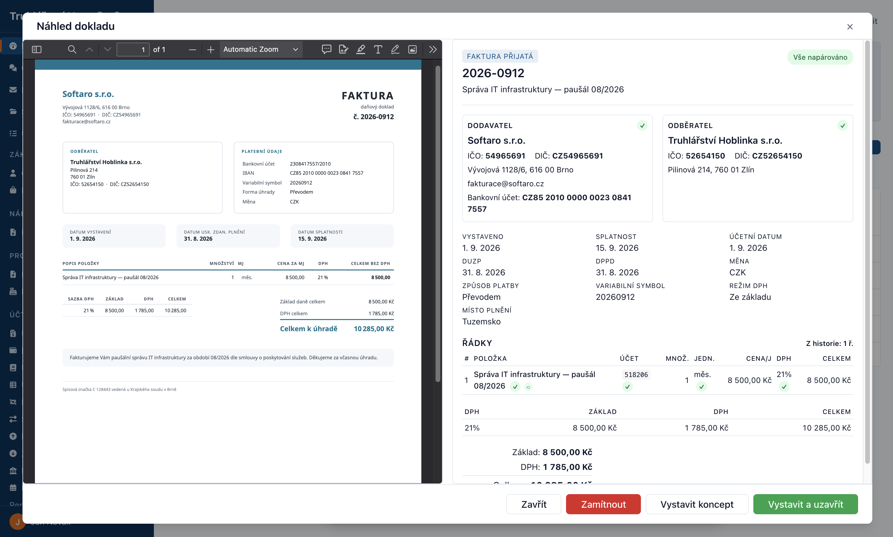
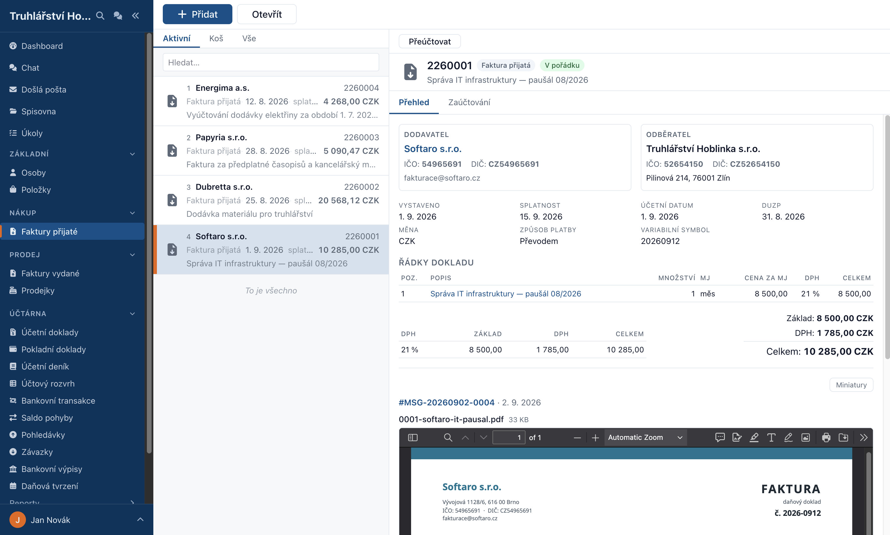

# Shipard

Shipard je webová aplikace pro firemní účetnictví, faktury a dokumenty.
Pomáhá omezit ruční přepisování: přijatou fakturu přepošleš e-mailem nebo
nahraješ jako soubor a AI z ní připraví návrh dokladu ke kontrole.

Vyvíjíme ho pro **samostatné účetní, kteří vedou účetnictví několika
klientům**, a pro **podnikatele ve spolupráci s vlastní účetní**.
Shipard pomáhá s přípravou a zpracováním dokladů; kontrola a odpovědnost
za správnost účetnictví zůstávají na člověku.

## Od přijaté faktury k dokladu

1. **Pošli nebo nahraj fakturu.** Přepošli ji na adresu své firmy
   v Shipardu, nebo přetáhni PDF na Dashboard.
2. **Zkontroluj návrh.** AI přečte dodavatele, položky a částky.
   Návrh porovnáš s originálem a případné chyby opravíš před vystavením.
3. **Vystav doklad.** Najdeš ho v přehledu přijatých faktur. Na jeho
   dokončení navazuje automatické zaúčtování a evidence závazku.

*Před vystavením porovnáš údaje připravené AI s originálem faktury.*

*Stejná faktura po vystavení — údaje dokladu i původní příloha na jednom místě.
Oba snímky používají ukázková data.*

## Co ti Shipard pomůže vyřídit

- **Přijaté faktury** — od nahrání a kontroly návrhu po zaúčtování.
  Doklad můžeš zadat i ručně.
- **Práci k vyřízení** — Dashboard soustředí novou poštu, návrhy dokladů
  a upozornění na nesrovnalosti.
- **Účetnictví a úhrady** — účetní deník, přehledy a párování faktur
  s platbami z importovaných bankovních výpisů.
- **Orientaci v datech a aplikaci** — vestavěného asistenta v Chatu
  se můžeš ptát na své údaje i na postupy práce. Asistent data pouze čte.

Další agendy a jejich možnosti popisuje
[přehled toho, co Shipard umí](help/co-shipard-umi.md).

## V jakém jsme stavu

**Shipard je v alfa verzi a hledáme lidi, kteří ho s námi budou zkoušet.**
Teď se soustředíme především na zpracování přijatých faktur a správnost
navazujícího účetnictví. Pomůže nám vědět, jak si poradí s tvými doklady
a kde je práce v aplikaci nejasná nebo zbytečně složitá.

Aplikace se aktivně vyvíjí a zatím nepokrývá celý účetní provoz.
Například živé přehledy DPH už existují, ale export pro podání na daňový
portál ještě chybí. Vydané faktury lze evidovat a zaúčtovat, jejich tisk,
PDF a odeslání odběrateli zatím nejsou k dispozici. Proto zatím nepoužívej
Shipard jako jediné místo, kde vedeš účetnictví.

Podrobnosti najdeš v [přehledu omezení](help/co-dnes-nejde.md).
[Roadmapa](docs/roadmap.md) ukazuje, co doděláváme a v jakém pořadí.

## Chci to vyzkoušet

**Stačí prohlížeč, aplikaci provozujeme my.** O přístup si napiš na
**podpora@shipard.cz**. Jak získat pozvánku, začít s první fakturou
a poslat nám zpětnou vazbu popisuje [průvodce pro testery](TESTERS.md).

## Návody a komunita

- [Začínáme](help/zaciname.md) — první přihlášení, nastavení a první faktura.
- [Uživatelské návody](help/README.md) — jak se v Shipardu dělají jednotlivé věci.
- [Nahlásit chybu nebo napsat nápad](https://github.com/shipard/shipard/issues/new/choose)
  — pravidla pro veřejná hlášení najdeš v [průvodci pro testery](TESTERS.md#5-jak-nahlásit-chybu).

Rychlý dotaz, nejasnost, nebo si jen chceš popovídat o tom, kam Shipard
míří? Máme **[Discord](https://discord.gg/PWTt5EUFAV)** — je nás tam
zatím hrstka, ale odpovídáme rychle a žádná otázka není moc malá.
Přijď klidně jen nakouknout.

## Pro vývojáře

Shipard má modulární backend v **PHP 8.5** s **MariaDB**, REST API
a frontend ve **Svelte 5**. Podporuje provoz více firem na jednom serveru
s oddělenými daty.

- [Průvodce vývojáře](DEVELOPERS.md) — zprovoznění vývojového prostředí na Ubuntu LTS.
- [Technická dokumentace](docs/README.md) — architektura, moduly, API a provoz.
- [Přehled funkcí a plánů](docs/features.md) — hotové, rozpracované a plánované možnosti.
